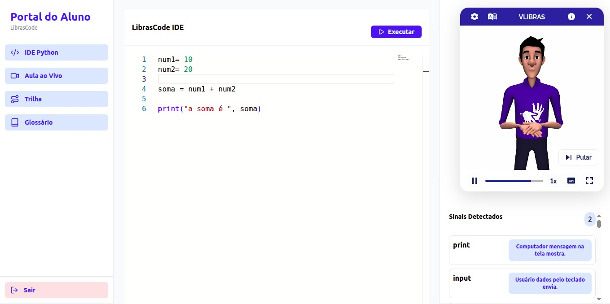
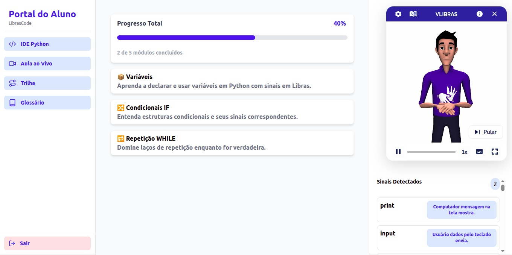
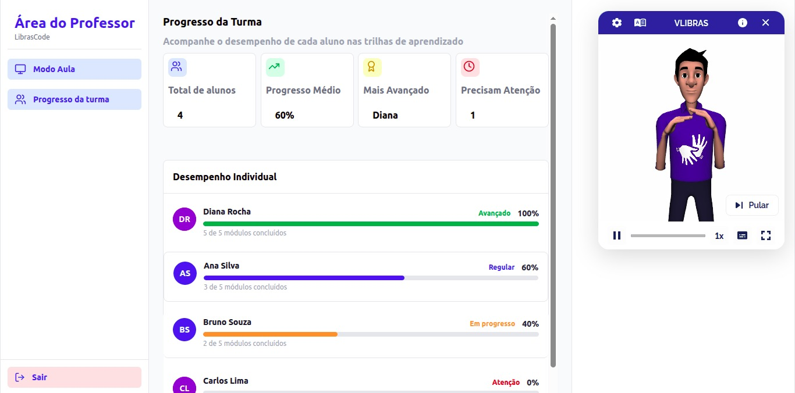
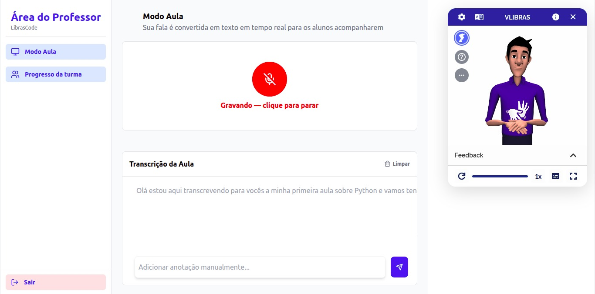

# LibrasCode - Front-end

Plataforma inclusiva para ensino de programação com suporte em Libras. Este é o módulo de interface do usuário, construído com React e Tailwind CSS, responsável pela experiência de aprendizado, IDE de código e integração com o avatar do VLibras.

## 🚀 Funcionalidades Principais
* **IDE de Código:** Editor Monaco (mesma base do VS Code) para prática de Python.
* **Aula ao Vivo:** Interface de recepção de transcrições em tempo real via WebSocket no portal do aluno.
* **Glossário Semântico:** Dicionário com termos técnicos mapeados na estrutura gramatical SOV da Libras.
* **Trilhas de Aprendizado:** Simulação do acompanhamento gamificado do progresso do aluno.
* **Avatar Integrado:** Integração nativa com o plugin VLibras para tradução visual.
* **Progresso de classe** Simulação do funcionamento do dashboard de progresso dos alunos no portal do professor
* **Transcrição de aula ao vivo** Interface de recepção de transcrições em tempo real via WebSocket no portal do Professor

## 🛠 Tecnologias
* React + Vite
* TypeScript
* Tailwind CSS
* Lucide React
* Monaco Editor

## 💻 Como Rodar

Clone o repositório e siga os passos abaixo. 

1. Certifique-se de ter o [Node.js](https://nodejs.org/) instalado.
2. No diretório do projeto, instale as dependências: `npm install`
3. Inicie o servidor de desenvolvimento: `npm run dev`

## 🏗 Arquitetura do Projeto
O projeto foi estruturado para ser modular e escalável, separando claramente as responsabilidades entre os perfis de usuário:

* **`/src/paginas/`**: Organizada para separar a lógica de acesso: 
  *  `/alunos/`: Contém os componentes do portal do estudante (Aula Ao Vivo, Trilhas, IDE). 
	*  `/professores/`: Contém os componentes do portal do professor (Dashboards de Progresso, Transcrição). * `/`: Páginas de entrada e navegação inicial. 
* **`/src/dadosMocados/`**: Contém o arquivo `dicionarioPythonSov.ts`.  Esta é a nossa base de dados atual, onde mapeamos os termos técnicos de Python para a estrutura gramatical SOV da Libras, permitindo que o sistema funcione de forma independente antes da integração final com banco de dados.

## 🔗 Conectando ao Back-end
O LibrasCode Front-end funciona normamelmente sem o backend, porém  depende da comunicação WebSocket com o servidor FastAPI para ativar a funcionalidade de transcrição em tempo real.

1. Clonem o repositório   [Repositório LibrasCode-backend](https://github.com/rafaelalex16/LibrasCode-backend.git) X e sigam as instruções do README
2. Certifique-se de que o **Back-end** esteja rodando (padrão em `http://localhost:8003`).
3. Com ambos os terminais rodando, o Front-end estabelecerá a conexão automaticamente na funcionalidade de Modo Aula - Professor e Aula ao Vivo - Aluno.

## 📸 Imagens do Projeto

